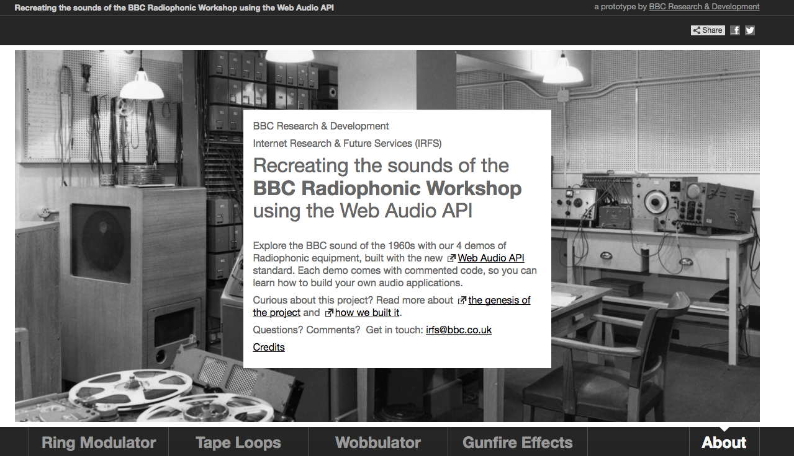
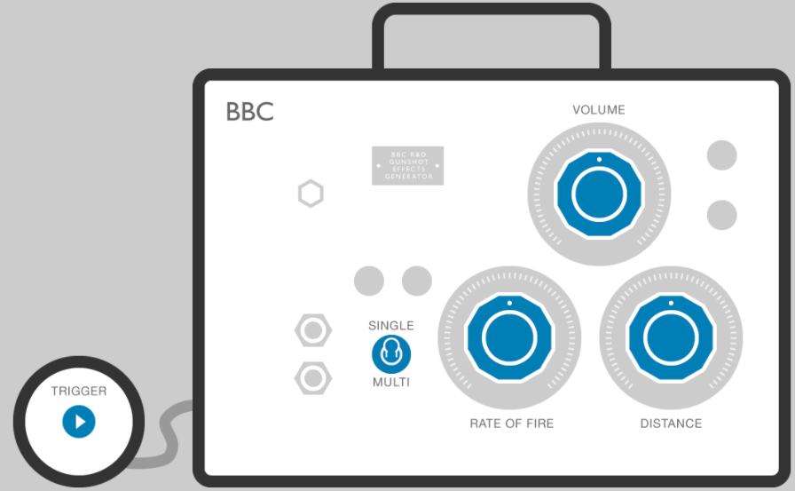
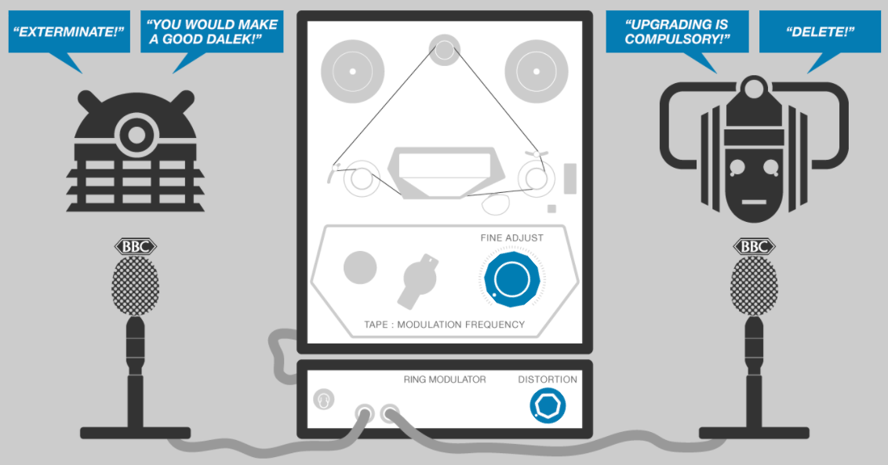
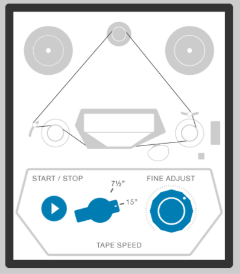
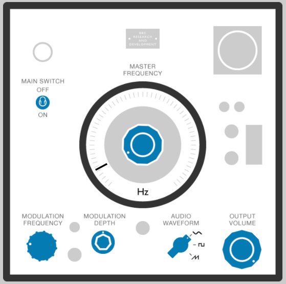

# Radiophonics WebAudio API demo

This repo contains the source code to build the radiophonics
[demonstration website](http://webaudio.prototyping.bbc.co.uk).




# Install

To build the site yourself install the required ruby gems with

```bash
rbenv exec bundle install
npm install
```

# Build

Use [CoffeeScript](http://coffeescript.org/) to compile the JS sources

```bash
make build
```

Generate the annotated source documentation with

```bash
make doc
```

# Develop

And then build and serve the site using stasis

```bash
make serve
```

The site will be available on [http://localhost:3000](http://localhost:3000).

# WebAudio Components

## Gunfire

- [gunfire.coffee](src/gunfire.coffee)




## Ring Modulator

- [ring-modulator.coffee](src/ring-modulator.coffee)




## Tape Loops

- [tapeloops.coffee](src/tapeloops.coffee)




## Wobbulator

- [wobbulator.coffee](src/wobbulator.coffee)



# Components

## Knob

- [knob.coffee](src/knob.coffee)

## Speech Bubble

- [speechbubble.coffee](src/speechbubble.coffee)

## Switch

- [switch.coffee](src/switch.coffee)

# License

> Copyright 2016 British Broadcasting Corporation
>
> Licensed under the Apache License, Version 2.0 (the "License");
> you may not use this file except in compliance with the License.
> You may obtain a copy of the License at
>
>     http://www.apache.org/licenses/LICENSE-2.0
>
> Unless required by applicable law or agreed to in writing, software
> distributed under the License is distributed on an "AS IS" BASIS,
> WITHOUT WARRANTIES OR CONDITIONS OF ANY KIND, either express or implied.
> See the License for the specific language governing permissions and
> limitations under the License.
